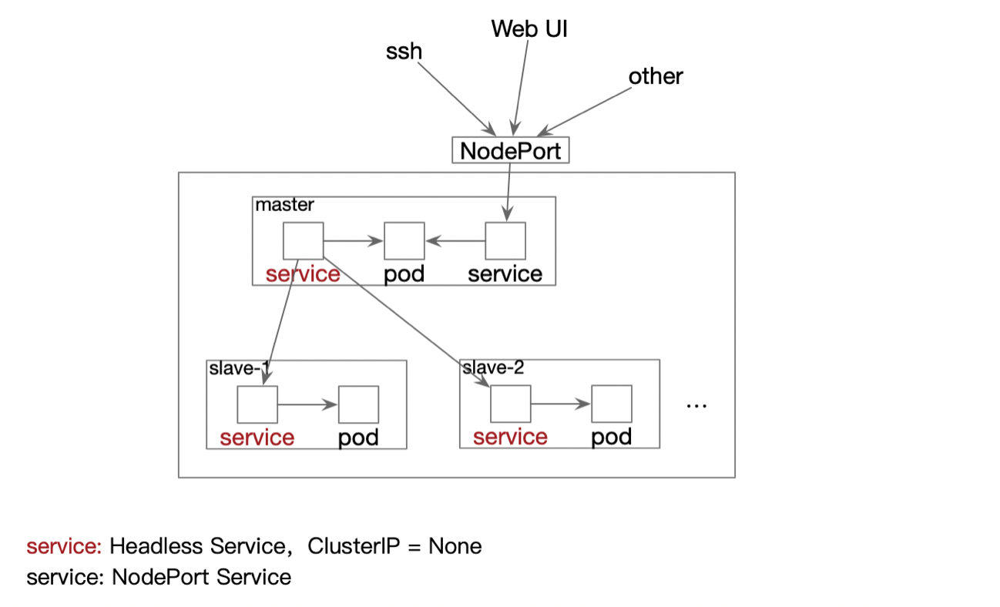

# Spark-cluster Oeprator

## 概述
此项目利用kubernetes所提供的CRD特性，实现了自定义的Spark-cluster Operator。使用此Operator，用户无需对Hadoop/Spark集群进行繁琐且易错的环境配置，而只需使用若干参数，来对所期望的Hadoop/Spark集群进行描述，Operator便可自动在kubernetes平台上部署满足条件且可用的Hadoop/Spark集群。
	
## 系统介绍
Spark-cluster Operator部署的Hadoop/Spark集群，同时对Hadoop和Spark环境进行了配置，且支持两种任务的运行(Hadoop版本为2.7.2，Spark版本为2.4.0)。

* Hadoop/Spark集群架构
	
	参照Hadoop中的主从模式(Master -- Namenode和ResourceManager， Slave -- Datanode和NodeManager)，将Master和Slave分别部署到独立的Pod中运行。在kubernetes平台中，Pod相互之间的通信由Service来负责，因此集群中为每一个Pod部署一个同名的Headless Service。使用Headless Service是为了保证访问Headless Service便可以直接访问到后端的同名Pod。
	
	除了上述的配置，集群还为Master Pod部署了一个NodePort Service，通过此方式将Pod内部的端口暴露出来，为用户提供了ssh、WebUI等查看管理Hadoop/Spark集群的功能。
	
	

* 参数配置

	Spark-cluster Operator允许用户指定偏好的参数，然后完成Hadoop/Spark集群的部署，具体的参数包括(*表示必须指定)：
	- *slaveNum ：集群中应包含的Slave节点数，正整形数值表示
	
	- pvcEnable ：是否启用持久化存储(由ceph文件系统进行支持)，True/False。持久化存储保证了当Master或者Slave发生意外故障重启时，集群在故障之前所保存的数据依然存在。为避免数据丢失，用户在启用持久化存储的同时，应将需要持久化的内容放置到HDFS文件系统对应的路径下(Master节点：/root/hdfs/namenode，Slave节点：/root/hdfs/datanode)。默认不使用。
	
	- ports ：暴露端口号port(正整形数值)和端口名称name(字符串值)的集合。用户可通过ports参数来对Master中的内部端口进行暴露。在集群中，默认暴露了22、8080、50070、8080和4040端口，分别用于ssh和Hadoop/Spark Web UI访问。
	
	- resources ：资源配置，应用于集群中的所有节点。资源包括CPU和内存Memory，配置包括需求量requests和限制量limits。默认不配置。
	
	- nfs：使用共享文件夹功能，指定共享文件夹所在地址server及对应路径path。将server:path下的文件夹挂载到集群中的Master Pod中。默认不使用。
	
```
apiVersion: spark.k8s.io/v1alpha1
kind: SparkCluster
metadata:
  labels:
    app: hadoop-spark-slave

# unalterable
# --- 
# self-defined

  name: cluster-1
spec:
  slaveNum: 3
  pvcEnable: False
  
  ports:
    - port: 18080
      name: job

  resources:
    limits:
      cpu: "2"
      memory: "2000Mi"
    requests:
      cpu: "1"
      memory: "1500Mi"

  nfs:
    path: /hadoop/share-data
    server: 1.2.3.4
```
  		
	
## API介绍
* GET 	/apis/sparkcluster
	
	返回集群的信息

* POST /apis/sparkcluster

	使用参数中的配置文件，创建一个新的集群，返回创建信息

* GET /apis/terminal?sparkcluster=cluster-1

	返回一个内嵌的终端，终端对应于集群名称为cluster-1中的Master Pod中所运行的容器


