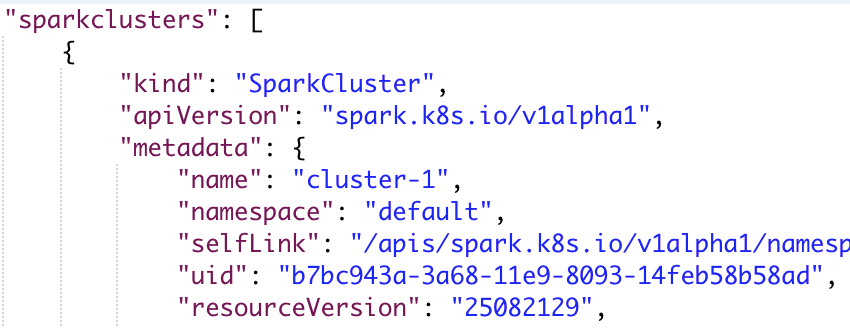

# Spark-cluster Operator


## 概述
此项目利用kubernetes所提供的CRD特性，实现了自定义的Spark-cluster Operator。使用此Operator，用户无需对Hadoop/Spark集群进行繁琐且易错的环境配置，而只需使用若干参数，来对所期望的Hadoop/Spark集群进行描述，Operator便可自动在kubernetes平台上部署满足条件且可用的Hadoop/Spark集群。
	
## 系统介绍
Spark-cluster Operator部署的Hadoop/Spark集群，同时对Hadoop和Spark环境进行了配置，且支持两种任务的运行(Hadoop版本为2.7.2，Spark版本为2.4.0)。

* Hadoop/Spark集群架构
	
	参照Hadoop中的主从模式(Master -- Namenode和ResourceManager， Slave -- Datanode和NodeManager)，将Master和Slave分别部署到独立的Pod中运行。在kubernetes平台中，Pod相互之间的通信由Service来负责，因此集群中为每一个Pod部署一个同名的Headless Service。使用Headless Service是为了保证访问Headless Service便可以直接访问到后端的同名Pod。
	
	除了上述的配置，集群还为Master Pod部署了一个NodePort Service，通过此方式将Pod内部的端口暴露出来，为用户提供了ssh、WebUI等查看管理Hadoop/Spark集群的功能。
	
	

* 参数配置

	Spark-cluster Operator允许用户指定偏好的参数，然后完成Hadoop/Spark集群的部署，具体的参数包括(*表示必须指定)：
	- *slaveNum ：集群中应包含的Slave节点数，正整形数值表示
	
	```
	slaveNum: 3
	```
	
	- pvcEnable ：是否启用持久化存储(由ceph文件系统进行支持)，True/False。持久化存储保证了当Master或者Slave发生意外故障重启时，集群在故障之前所保存的数据依然存在。为避免数据丢失，用户在启用持久化存储的同时，应将需要持久化的内容放置到HDFS文件系统对应的路径下(Master节点：/root/hdfs/namenode，Slave节点：/root/hdfs/datanode)。默认不使用。
	
	```
	pvcEnable: False
	```
	
	- ports ：暴露端口号port(正整形数值)和端口名称name(字符串值)的集合。用户可通过ports参数来对Master中的内部端口进行暴露。在集群中，默认暴露了22、8080、50070、8080和4040端口，分别用于ssh和Hadoop/Spark Web UI访问。
	
	```
	ports:
	- port: 18080
	  name: job
  ```
	
	- resources ：资源配置，应用于集群中的所有节点。资源包括CPU和内存Memory，配置包括需求量requests和限制量limits。默认不配置。

	```
	resources:
	  limits:
	    cpu: "2"
	    memory: "2000Mi"
  	  requests:
  	    cpu: "1"
  	    memory: "1500Mi"
    ```
	
	- nfs：使用共享文件夹功能，指定共享文件夹所在地址server及对应路径path。将server:path下的文件夹挂载到集群中的Master Pod中的相同路径下。默认不使用。
	
	```
	nfs:
	  path: /hadoop/share-data
	  server: 1.2.3.4
	```
	
## 使用终端命令行操作集群

#### 获得Master终端
Spark-cluster Operator为用户提供了两种进入集群Master节点的方式，使得用户可以通过终端命令行来对部署好的集群进行操作：

* 调用API接口 ：用户可调用Operator提供的[API接口](#1)，在参数中指定集群的名称，返回结果为内嵌的终端，终端便对应于指定集群名称的Master节点。用户可通过终端来进行具体的操作。

* 使用ssh命令 ：在集群中，Operator默认将Master节点的22端口通过NodePort的方式进行暴露，因此用户通过kubernetes集群的主节点ip和暴露出来的端口号(已获得且允许访问)，可直接使用ssh命令来进入到Master节点中，默认密码为123456。
> ssh 1.2.3.4 -p 暴露的端口号

<h4 id="2">示例操作</h4>
用户通过上述的方法获得集群Master节点的终端，由于Operator已经完成了集群中对于Hadoop/Spark的若干环境配置(对应Home目录为\$HADOOP\_HOME和\$SPARK\_HOME)，因此下面将解释相关脚本，然后直接使用hdfs等命令，来演示几种基础简单的示例操作：

* 基础脚本 ：部署好的Hadoop/Spark集群中的每一个节点(Master或者Slave)的根目录下，都有三个基础脚本：

	- start.sh ：在当前节点中启动相关类型的进程(Master -- Namenode、ResourceManager和HistoryServer， Slave -- Datanode和NodeManager)。用户可在相关进程意外关闭时使用。

	- stop.sh ：在当前节点中关闭相关类型的进程(Master -- Namenode和ResourceManager， Slave -- Datanode和NodeManager)。用户可在调试管理集群时使用。

	- run-wordcount.sh ：创建两个简单的文本文件，将其复制到HDFS文件系统后，然后运行自带的WordCount程序并输出结果。用户可通过此脚本来检测当前集群是否能够正常地运行MapReduce任务。

	

* 验证集群的部署状态 ：使用hdfs命令，来查看当前集群中健康的Slave节点数及集群相关的存储状态。用户可在任意的时刻使用此命令来验证集群中HDFS文件系统的部署状态。
> hdfs dfsadmin -report

	

* 运行WordCount程序 ：直接运行根目录下的run-wordcount.sh脚本。
> ./run-wordcount.sh

	
	

* 本地运行spark任务 ：进入到Spark的Home目录并运行计算π的例子，运行成功则说明当前集群支持本地运行Spark任务。
> cd $SPARK_HOME && ./bin/run-example SparkPi

	
	 

<h2 id="1">API介绍</h2>
* GET 	/apis/sparkcluster
	
	返回对应部署的集群的信息(JSON格式)。
	
	
	
	前面所介绍的相关参数可以从annotation中看到：
	
	

* POST /apis/sparkcluster

	使用参数中的用户所指定的参数信息(JSON格式)，整合前面参数配置小节中的配置为例：
	
	```
	slaveNum: 3
	pvcEnable: False
	
	ports:
    - port: 18080
      name: job
      
    resources:
      limits:
        cpu: "2"
        memory: "2000Mi"
      requests:
        cpu: "1"
        memory: "1500Mi"
    
    nfs:
      path: /hadoop/share-data
      server: 1.2.3.4
	```
	
	创建一个新的集群，返回请求状态码和集群的信息：
	
	
	
	

* GET /apis/terminal?sparkcluster=cluster-1

	在参数中指定集群名称，结果将返回一个web终端，终端对应于集群名称为cluster-1中的Master Pod中所运行的容器。用户可直接在终端中使用命令行来对集群进行操作，详见[示例操作](#2)。
	
	


